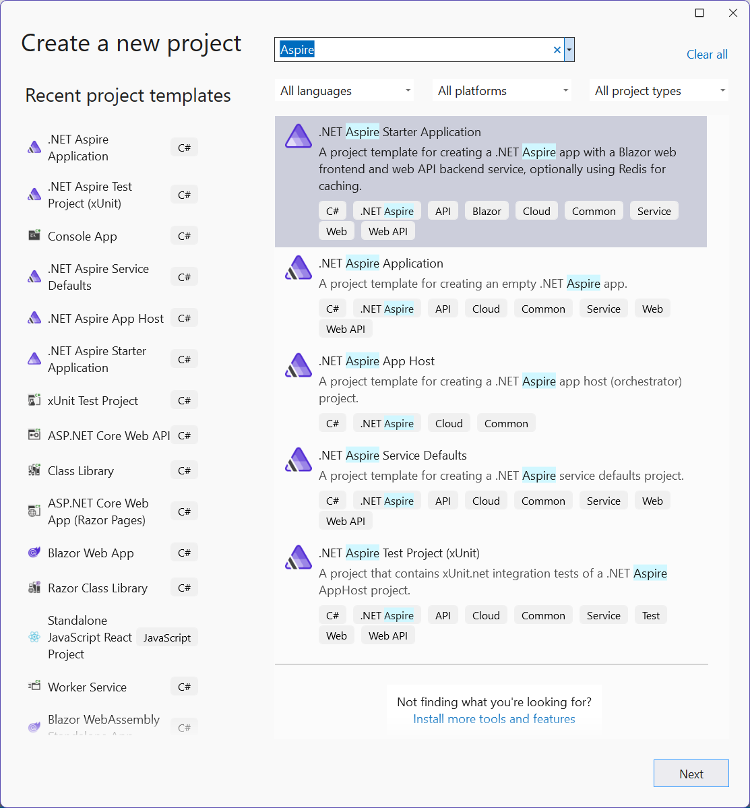

# Create the .NET Aspire template
To create a new .NET Aspire Starter Application, you can use either Visual Studio, Visual Studio Code, or the .NET CLI.

Visual Studio provides .NET Aspire project templates that handle some initial setup configurations for you. Complete the following steps to create a project for this quickstart:

1. At the top of Visual Studio, navigate to File > New > Project.

2. In the dialog window, search for Aspire and select .NET Aspire Starter Application. Select Next.

On the Configure your new project screen:

Enter a Project Name of AspireSample.
Leave the rest of the values at their defaults and select Next.
On the Additional information screen:

- Make sure .NET 8.0 (Long Term Support) is selected.
- Ensure that Use Redis for caching (requires a supported container runtime) is checked and select Create.
- Optionally, you can select Create a tests project. For more information, see [Write your first .NET Aspire test.](https://learn.microsoft.com/en-us/dotnet/aspire/testing/write-your-first-test?pivots=xunit)

Visual Studio creates a new solution that is structured to use .NET Aspire.

To learn more about .NET Apire [click here](https://learn.microsoft.com/en-us/dotnet/aspire/).